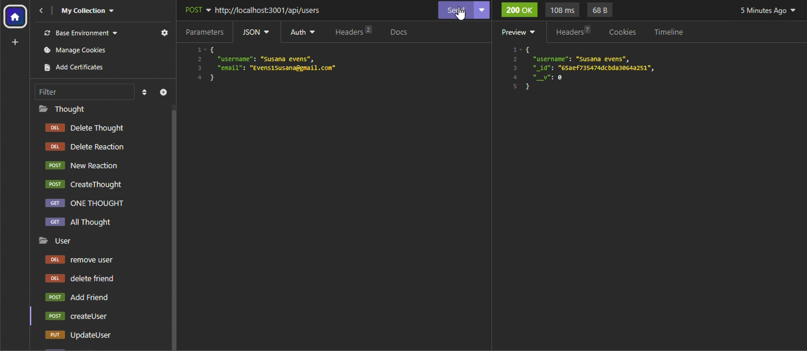
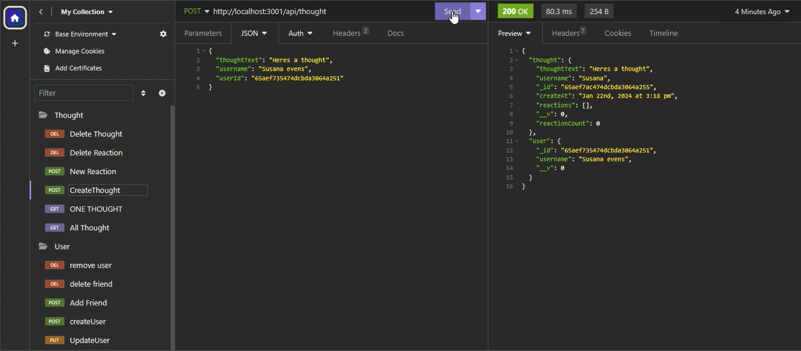
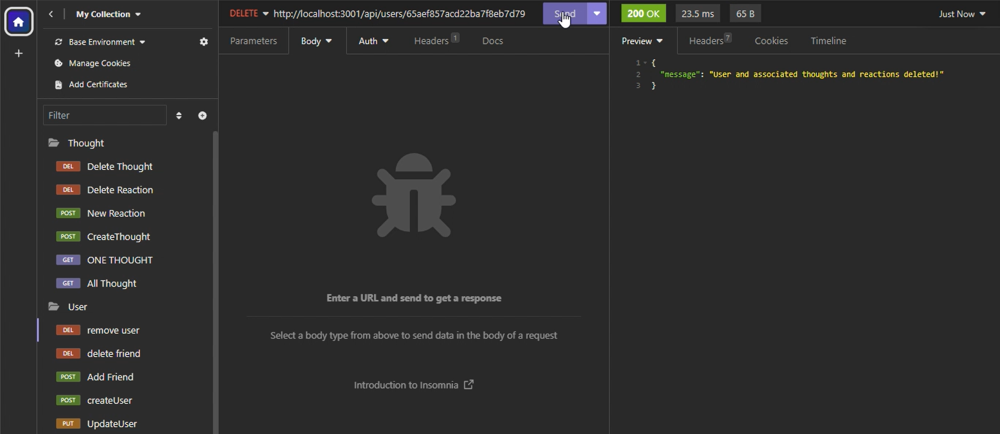
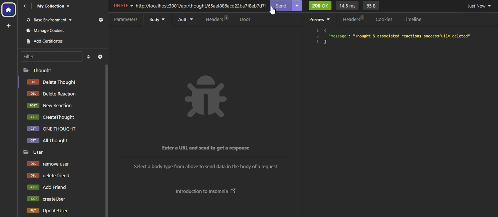

# Social-Network-API

## Table of Contents
 -[Description](#Description)
 -[Installation](#installation)
 -[Usage](#usage)
 -[Credits](#credits)
 -[License](#license)
 -[Question](#question)

 ## Description

 This application is a Social network application that utilized packages and databases for users to create their account, thier thought, or react to other peoples thoughts as well. People are able to save their information to the dasebase from mongoose that the application runs on. Express.js runs on the pack end to add,update or delete information from the dasebase depending on what the user submits on routes. The routes is set up as crud API so it can update the information of the user depending where he's at on the page.

 ## Installation

    install all packages

 ``````
 npm i
 ``````

 dependence:
    -Express@4.18.2
    -mongoose@8.0.4

## Usage
Creating a user


Creating a Thought


Removing both user and Thought





Demo Video:
https://drive.google.com/file/d/1TPhpgkcJHRGRyIE4pCnkwqED1PwvJtvP/view

## Credit


    Express.js - route structure

    mongoose - dasebase


## License

MIT License

## Question

Have questions? Click the link to my github.